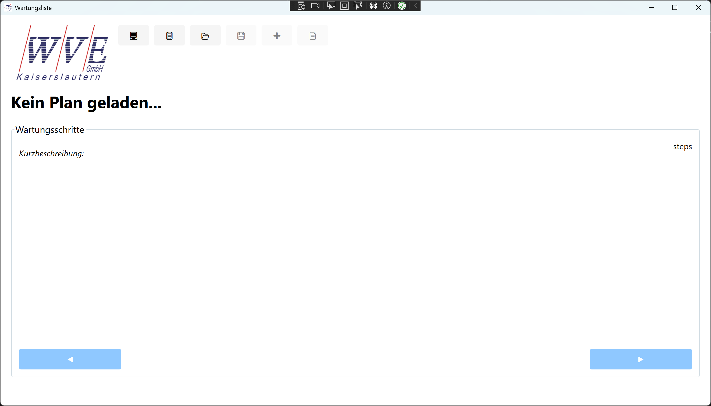
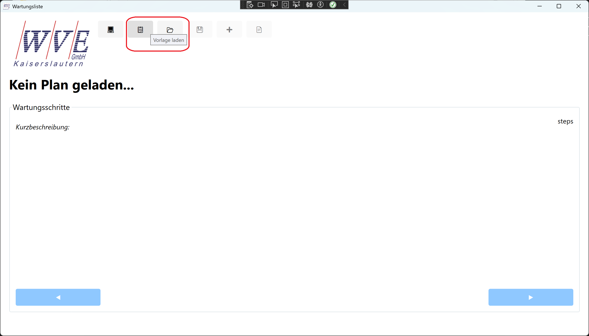
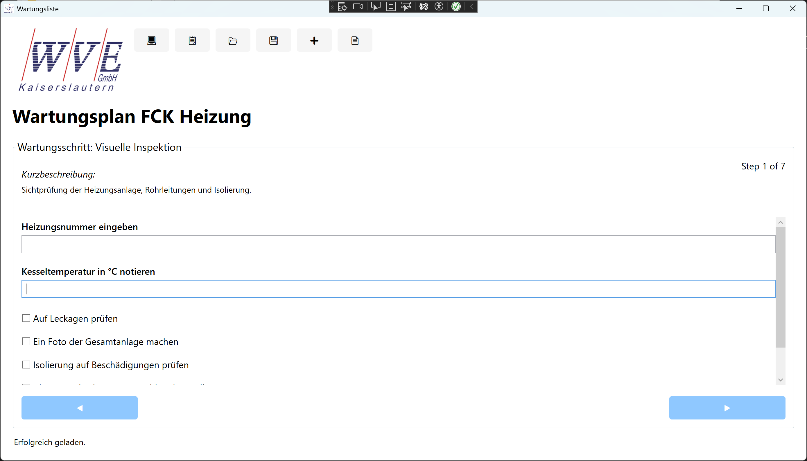
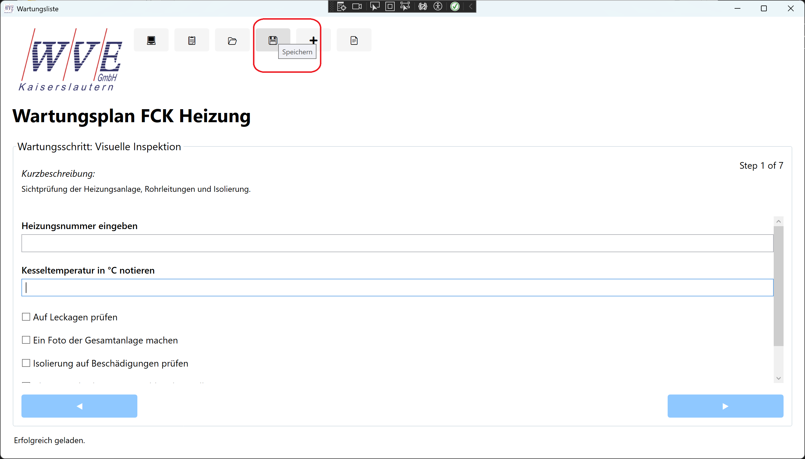
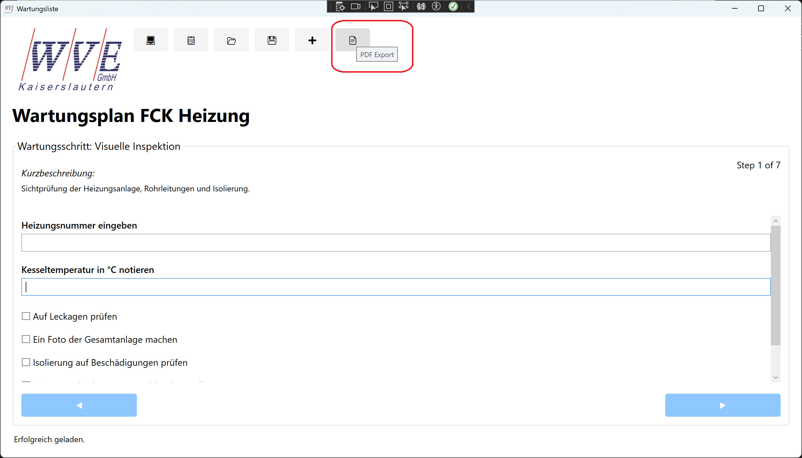

# mitoSoft.CheckList

Eine WPF-Anwendung zur Verwaltung und Durchführung von Wartungsplänen mit integrierter Foto-Dokumentation und PDF-Export.

## 🚀 Features

- ✅ **Schrittweise Wartungsabläufe** - Führe Wartungen Schritt für Schritt durch
- 📋 **Vorlagen-System** - Erstelle wiederverwendbare Wartungsvorlagen
- 📸 **Foto-Dokumentation** - Integriere Fotos direkt in deine Wartungsberichte
- 📄 **PDF-Export** - Exportiere vollständige Wartungsberichte als PDF
- 💻 **Desktop & Tablet Modus** - Optimierte Ansichten für verschiedene Geräte
- 📝 **Verschiedene Aufgabentypen** - Checkboxen, Texteingaben, Zahleneingaben und Fotos

## 📖 Anleitung

### Erste Schritte

Beim Start der Anwendung siehst du die Hauptoberfläche mit der Symbolleiste am oberen Rand:



Die Symbolleiste enthält folgende Buttons:
- 💻 **Modus wechseln** - Zwischen Desktop- und Tablet-Modus umschalten
- 📋 **Vorlage laden** - Eine Wartungsvorlage laden
- 📂 **Laden** - Einen bestehenden Wartungsplan laden
- 💾 **Speichern** - Aktuellen Plan speichern
- ➕ **Speichern unter** - Plan unter neuem Namen speichern
- 📄 **PDF Export** - Wartungsbericht als PDF exportieren

### 1. Vorlage laden

Klicke auf den Button **📋 Vorlage laden**, um eine Wartungsvorlage aus dem Ordner `Dokumente\Wartungsvorlagen` zu laden.



Vorlagen enthalten die Struktur deiner Wartungsabläufe und können mehrfach verwendet werden.

### 2. Wartungsschritte durchführen

Nach dem Laden einer Vorlage oder eines Plans werden die einzelnen Wartungsschritte angezeigt:



Jeder Schritt kann verschiedene Aufgabentypen enthalten:
- ☑️ **Checkboxen** - Für einfache Ja/Nein-Aufgaben
- 📝 **Texteingaben** - Für beschreibende Informationen
- 🔢 **Zahleneingaben** - Für Messwerte
- 📸 **Foto-Aufgaben** - Zum Anhängen von Fotos

**Navigation:**
- Mit **◀ Zurück** und **▶ Weiter** navigierst du zwischen den Schritten
- Der **Weiter**-Button wird erst aktiviert, wenn alle Aufgaben im aktuellen Schritt erledigt sind

**Foto-Aufgaben:**
- Klicke auf die Checkbox einer Foto-Aufgabe
- Die Kamera-Anwendung wird geöffnet
- Mache ein Foto oder wähle eine vorhandene Datei
- Das Foto wird mit der Aufgabe verknüpft und ein Link angezeigt
- Klicke auf den Link, um das Foto später anzuzeigen

### 3. Plan speichern

Während oder nach der Durchführung kannst du den Fortschritt speichern:



- **💾 Speichern** - Speichert den Plan am bisherigen Speicherort (im Ordner `Dokumente\Wartungen`)
- **➕ Speichern unter** - Speichert den Plan unter einem neuen Namen

Gespeicherte Pläne können später wieder geladen und fortgesetzt werden.

### 4. PDF-Export

Nach Abschluss der Wartung kannst du einen vollständigen Bericht exportieren:



Der PDF-Export enthält:
- Alle ausgefüllten Wartungsschritte
- Alle eingegebenen Daten
- Alle angehängten Fotos

Beim Export wird ein Ordner erstellt mit:
- `Wartungsbericht.pdf` - Der vollständige Bericht
- `Photos/` - Alle zugehörigen Fotos

### 5. Tablet-Modus

Klicke auf den **💻**-Button, um zwischen Desktop- und Tablet-Modus zu wechseln:

- **Desktop-Modus** - Kompakte Ansicht für Maus und Tastatur
- **Tablet-Modus** - Größere Bedienelemente für Touch-Bedienung

## 📁 Ordnerstruktur

Die Anwendung nutzt folgende Ordner in deinem Dokumente-Verzeichnis:

```
Dokumente/
├── Wartungsvorlagen/    # Wiederverwendbare Vorlagen (XML-Dateien)
└── Wartungen/           # Gespeicherte Wartungspläne (XML-Dateien)
```

Diese Ordner werden automatisch verwendet, wenn sie existieren.

## 🛠️ Technische Details

- **Framework**: .NET 10
- **UI-Framework**: WPF (Windows Presentation Foundation)
- **Dateiformat**: XML für Wartungspläne
- **Export-Format**: PDF

## 📋 Voraussetzungen

- Windows 10/11
- .NET 10 Runtime

## 💡 Tipps

- Erstelle Vorlagen für wiederkehrende Wartungen
- Nutze den Tablet-Modus für die Arbeit im Feld
- Mache Fotos direkt während der Wartung
- Exportiere den Bericht am Ende für deine Dokumentation
- Speichere regelmäßig während der Wartung

## 📝 Lizenz

[Lizenzinformationen einfügen]

## 👤 Autor

Michael Roth

## 🔗 Links

- [GitHub Repository](https://github.com/michaelroth1/mitoSoft.CheckList)